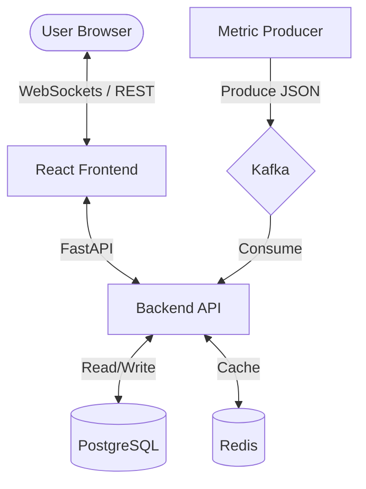

# Incident Command Center
Engineering dashboard for real-time mission control.

## Architecture


## Overview
A system for monitoring system health, managing incidents, and coordinating deployments. Includes a dashboard UI with real-time data streaming and role-based access control.

## Key Features
- Real-Time Streaming: Live metric charts (CPU, Latency, Error Rate) via WebSockets and Kafka.
- Authentication: JWT-based authentication with Role-Based Access Control (Admin and Engineer).
- Incident Management: CRUD operations for incidents and P0 escalation workflow.
- Deployment Tracking: History of production deployments.

## Tech Stack
- Frontend: React 18, TypeScript, Vite, Tailwind CSS, Recharts, Zustand.
- Backend: FastAPI, WebSocket Server, SQLAlchemy.
- Infrastructure: PostgreSQL, Redis, Kafka, Zookeeper.
- Ops: Docker Compose with healthchecks and automated data seeding.

## Setup
1. Start services:
   ```bash
   docker-compose up --build -d
   ```
2. Dashboard Access: `http://localhost:5173`
3. Credentials:
   - Admin: `admin` / `admin`
   - Engineer: `engineer` / `engineer`
